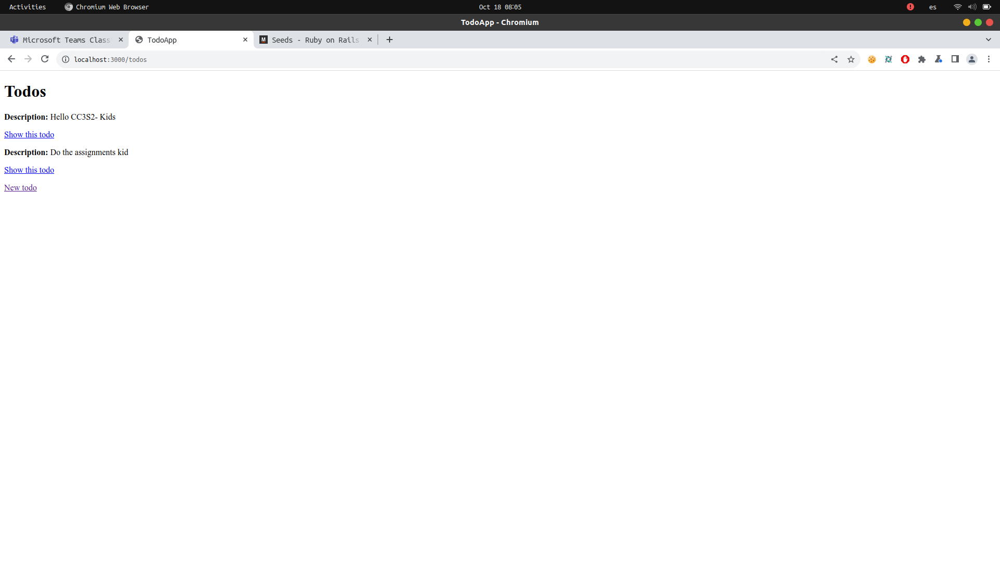
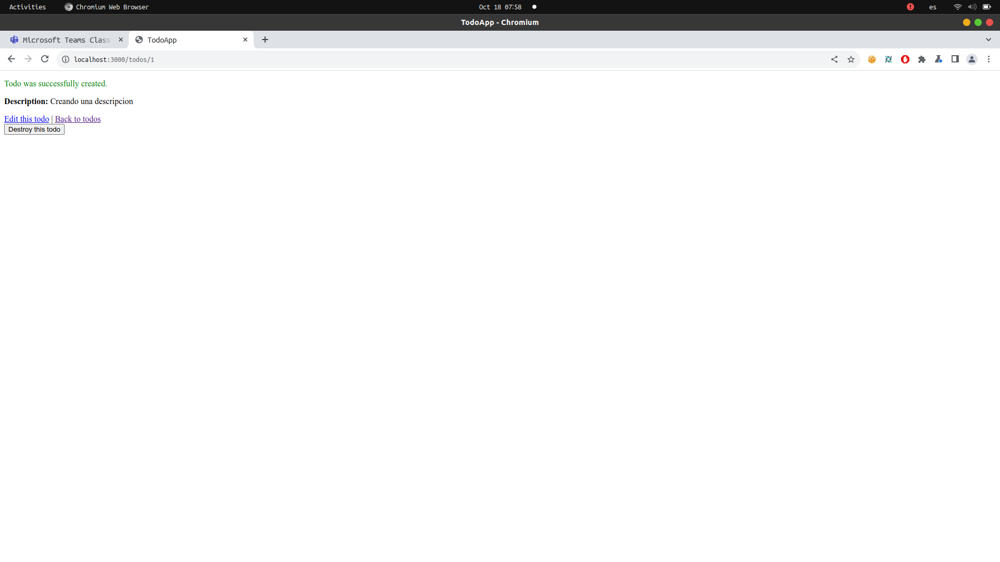
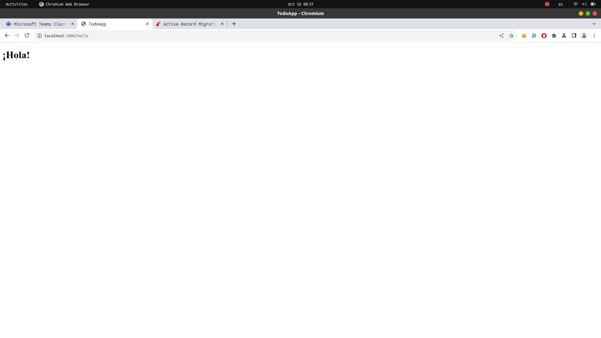

# Parte 2 Introduccion a Rails

Creando una aplicacion Rails desde la terminal

Luego de crearse la aplicación todo_app, una aplicación simple. Se ve que se creo un directorio todo_app en el que estarán los archivos y las gemas instaladas.

Usando el siguiente comando

En la siguiente imagen podemos ver que se han invocado a ciertas generadores para crear archivos en ciertos directorios como se ve en la imagen.

Primero podemos ver que se creo una migración en la base de datos. Además se creo un modelo.

Segundo, usando test_unit se creo como era de esperarse test_todo.rb archivo de testing para el nuevo recurso creado que es todos.

Tercero, se hizo el enroutamiento hacia los recurso todos, es decir que ahora si hacemos localhost:3000/todos, se podrá encontrar esa ruta. Ademas invocando a resource_route se crea el controlador del recurso, para definir metodos a cada ruta que se ingrese para new,show,create, etc.

Cuarto, se crearon las vistas en el directorio todos/

Quinto, se crearon test para usarlos con los controladores.

Finalmente, se crearon los helpers y jbuilder.

## Base de datos

Al ejecutar el comando bundle exec rake db:migrate,como se puede ver en la imagen

El comando rake busca en el directorio db/migrate, una tabla de migración con el timestamps para ejecutarlo. Ya que como se vio en el comando no se escribio el archivo que se crea con el comando generate, sino el directorio especificamente db:migrate.

En el archivo seed.rb que también esta en el directorio db/ pero no en migrate/. Insertamos algunos registros.

Al desplegarlo, antes de eso se tuvo que ejecutar rails db:seed para que se ingresen los registros que estan en el archivo seed a la base de datos. 

Lo desplegamos localmente con el comando rails server

Al haber generado un nuevo recurso que en ese caso fue todos con el comando generate anteriormente visto. La ruta a todos debe de existir

Al crear una nueva descripcion.Bueno se ve un formulario en la ruta todos/new. Y al darle al boton de crear.Se creo correctamente un registro. Y se ve la ruta /todos/{indice_registro}

Tambien podemos ver que hay enlaces. Para volver al indice de la aplicación, volver a editar la descripción o destruirlo

Al actualizar el nuevo registro, también se puede como se ve en la imagen el formulario esta en la ruta /todos/{indice}/edit

Al hacer click en destroy this todo. Se elimina la descripcion y regresa a la pagina principal que en este caso es /todos

Un cambio adicional que le podria hacer,es agregarle una validacion al campo de descripcion, ya que veo que la aplicacion funciona de manera correcta.

Por lo que veo en el archivo todos_controller.rb ya tenia implementado una condicional en caso no se ingrese una descripcion correcta así que la validación debería funcionar

Y bueno al ingresar una descripcion de menos de 10 caracteres y clickear create Todo, nos muestra ese error.

## Mas migraciones

## Nuevas Rutas

Creando una ruta /hello. En el archivo config/routes.rb

Luego necesitamos crear un controlador en todos para el metodo hello.

Para ello tambien necesitamos una vista para mostrar algo en pantalla

Y agregamos al metodo hello en el controlador 

Al ingresar a localhost:3000/hello

Debemos de ingresar a /hello no a /todos/hello, ya que ese cambio de ruta esta definido en routes.rb

## Mas ejercicios

Cambia el esquema de enrutamiento. Debes suponer que queremos una nueva ruta new_todo para ir a una página que crea un nuevo ítem Todo

Para ello agregamos el metodo GET 'new_todo' y bueno para no crear nuevamente la vista y el controlador esto redirecciona a todo#new que cumple la misma funcionalidad que la nueva ruta debe tener

